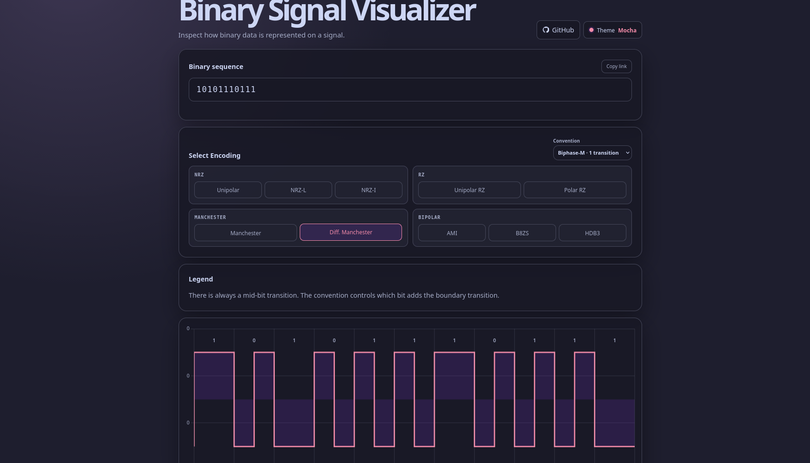

# Binary Signal Visualizer

Enter a binary sequence and inspect common Unipolar, Polar, Manchester, Bipolar, B8ZS, or HDB3 waveforms.



## Features

- TypeScript frontend with a reproducible Vite build.
- Common classroom encodings: NRZ, RZ, Manchester, Differential Manchester, and AMI.
- Manchester and Differential Manchester conventions can be switched from the encoding panel.
- B8ZS is labelled as the ANSI T1 / North-American convention; HDB3 is labelled as ITU-T G.703 / E1.
- Correct AMI substitutions for B8ZS and HDB3.
- Catppuccin Latte, Frappé, Macchiato, and Mocha palettes.
- `Default · browser` follows `prefers-color-scheme`: Latte for light mode and Mocha for dark mode.
- Responsive waveform rendering with bit boundaries and signal levels.
- Selected palette is saved locally.

## Run locally

```sh
nix develop
bun install
bun run dev
```

Create a production bundle with:

```sh
bun run build
```

## Encodings

| Encoding | Rule |
| --- | --- |
| Unipolar | `1` is +V; `0` is 0V |
| Unipolar RZ | A `1` returns to 0V halfway through the bit |
| NRZ-L | `1` is −V; `0` is +V |
| NRZ-I | `1` changes the level; `0` holds it |
| Polar RZ | A `1` starts at +V; a `0` starts at −V; both return to 0V |
| Manchester | Every bit transitions at mid-bit |
| Differential Manchester | Every bit transitions at mid-bit; `0` also transitions at its start |
| Bipolar AMI | `1` pulses alternate +V and −V; `0` is 0V |
| B8ZS | Replaces eight zeroes with `000VB0VB` |
| HDB3 | Replaces four zeroes with `000V` or `B00V` |
